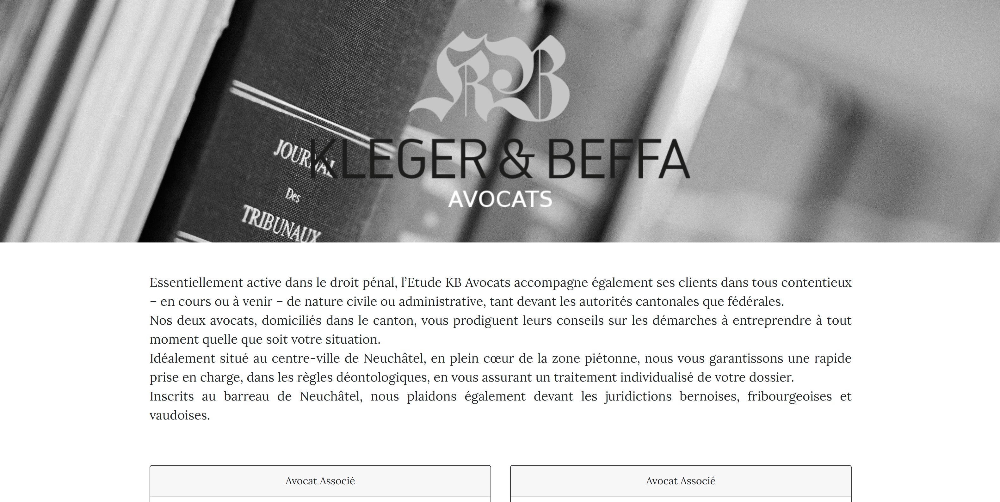

## KB Avocats

Presentation website without database built on top of Laravel 5.7 and Vue 2.*



To install Laravel dependencies (`vendor` folder):
```bash
	composer install
```

To install Vue dependencies (`node_modules` folder):
```bash
	npm install
```

Specify application encryption key:
```bash
	php artisan key:generate
```

To compile vue assets:
```bash
	npm run watch
```

To lunch dev environment:
```bash
	php artisan serve
```

then visit localhost:8000

To install external packages on the server:
```bash
	php ../../composer.phar update
```

Auto deployment to the server configured with Github Actions

### Credits
Webmaster: Jean-Marc Kleger